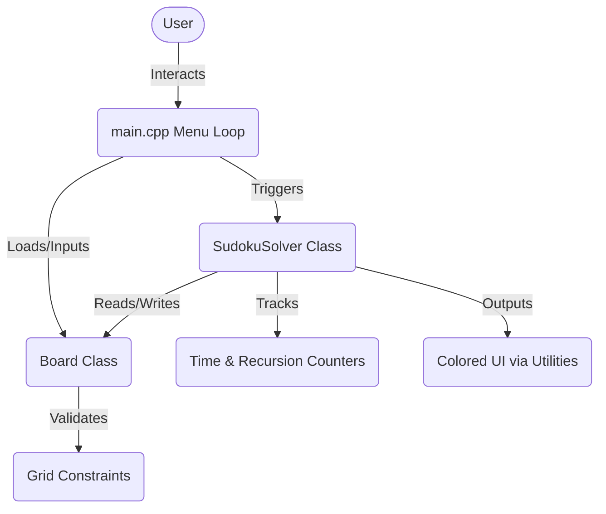
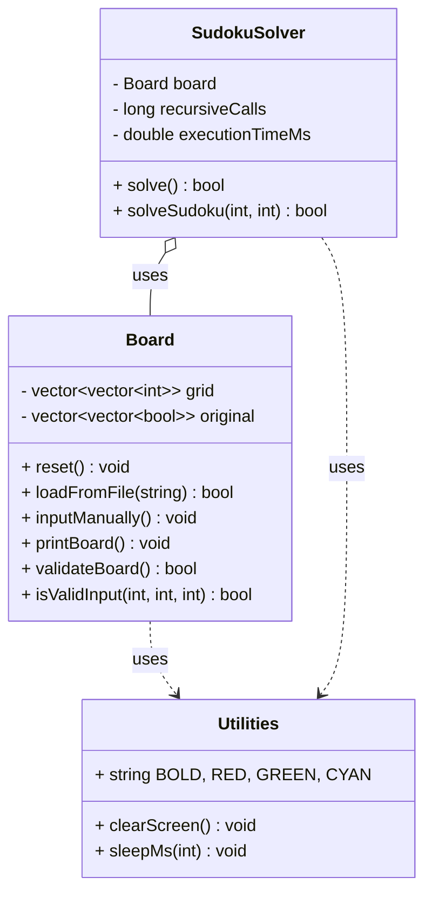
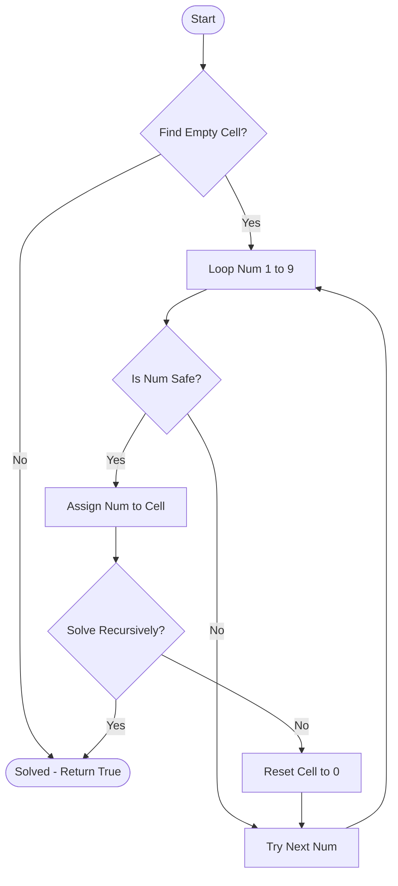
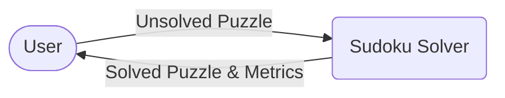
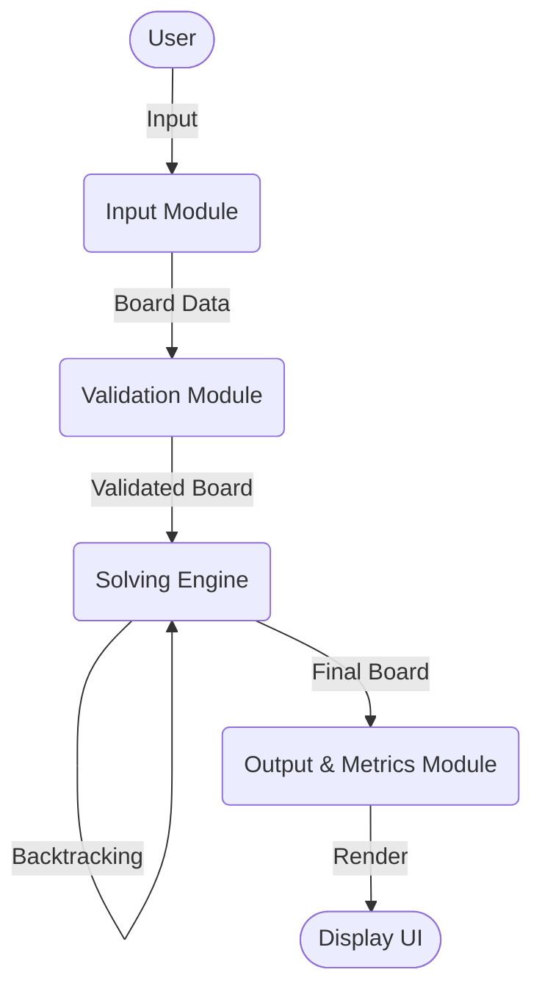
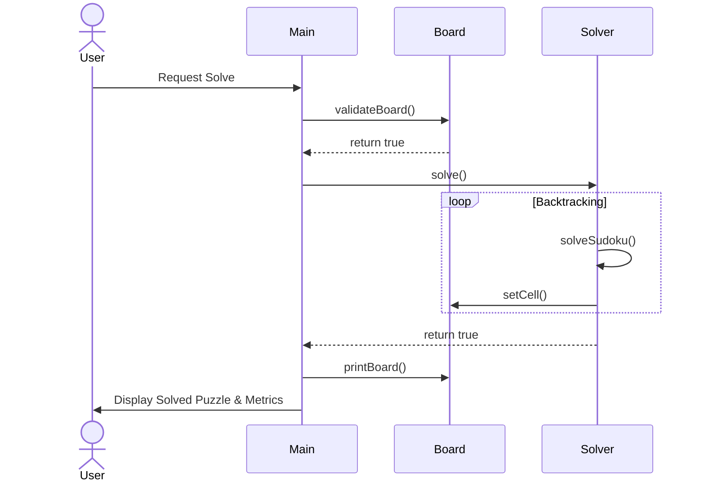

# PROJECT REPORT: Sudoku Solver Using Backtracking Algorithm in C++

## 1. Abstract
The Sudoku Solver is a robust C++ application designed to solve any valid 9x9 Sudoku puzzle using the Backtracking algorithm. The project demonstrates advanced knowledge of Data Structures and Algorithms (DSA), particularly Recursion, while providing an interactive and visually appealing Command Line Interface (CLI). Key performance metrics such as execution time and total recursive calls are tracked to analyze the efficiency of the backtracking process.

## 2. Introduction
Sudoku is a logic-based combinatorial number-placement puzzle. The objective is to fill a 9×9 grid with digits so that each column, each row, and each of the nine 3×3 subgrids that compose the grid contain all of the digits from 1 to 9. This project automates this solving process using algorithmic logic.

## 3. Objectives
- To implement an error-free Sudoku solving engine.
- To use Object-Oriented Programming (OOP) paradigms for modularity.
- To visualize the backtracking recursion stack.
- To evaluate time and space complexity metrics empirically.

## 4. Problem Statement
Given an incomplete 9x9 Sudoku board, write an algorithm that can accurately and efficiently fill all empty cells while respecting the mathematical constraints of the puzzle. The solution must gracefully handle invalid inputs and impossible boards.

## 5. Literature Review
Traditionally, Sudoku puzzles are solved by humans using deduction (e.g., naked singles, hidden pairs). Algorithmically, brute force is too slow (9^81 possibilities). Backtracking prunes the search space by immediately abandoning invalid branches, significantly reducing the required computations.

## 6. Requirement Analysis
- **Software**: C++17 Compiler (GCC/G++).
- **Hardware**: Standard modern CPU.
- **Skills**: C++ Basics, OOPs, Recursion, Console I/O.

## 7. System Design & Architecture

### Architecture Diagram


### Class Diagram


## 8. Flowchart


## 9. Algorithm & Pseudo Code
**Algorithm (Backtracking):**
1. Search for an unassigned location on the grid.
2. If no unassigned location is found, the puzzle is solved. Return `true`.
3. For digits 1 through 9:
   a. If the digit is safe to place (does not conflict with row, column, or 3x3 box):
      i. Place the digit.
      ii. Recursively attempt to fill in the rest of the grid.
      iii. If recursion returns `true`, return `true`.
      iv. Else, unassign the digit (backtrack).
4. Return `false` (this triggers backtracking).

**Pseudo Code:**
```text
function solveSudoku(board):
    if no empty cell exists: return True
    row, col = getEmptyCell(board)
    for num from 1 to 9:
        if isValid(board, row, col, num):
            board[row][col] = num
            if solveSudoku(board): return True
            board[row][col] = 0 // backtrack
    return False
```

## 10. Data Flow Diagrams

### DFD Level 0


### DFD Level 1


## 11. Diagrams

### Use Case Diagram
```mermaid
usecaseDiagram
    actor User
    User --> (Load File)
    User --> (Manual Input)
    User --> (Solve Instantly)
    User --> (Visualize Solving)
    User --> (Save Solution)
```

### Sequence Diagram


## 12. Testing

### Testing Table
| Test Case | Description | Expected Output | Result |
|-----------|-------------|-----------------|--------|
| TC1 | Load valid `sample.txt` | Puzzle loaded successfully | Pass |
| TC2 | Manual input with invalid duplicate | Invalid board warning | Pass |
| TC3 | Solve standard puzzle | Solved correctly, ~50ms time | Pass |
| TC4 | Solve empty board | Solved (generates valid grid) | Pass |
| TC5 | Unsolvable board | "No solution exists" | Pass |

### Sample Inputs & Outputs
**Input:** (from `sample.txt`)
```text
5 3 0 0 7 0 0 0 0
6 0 0 1 9 5 0 0 0
...
```

**Output:**
```text
Sudoku Solved Successfully!
Execution Time: 12.5 ms
Recursive Calls: 432
+-------+-------+-------+
| 5 3 4 | 6 7 8 | 9 1 2 |
| 6 7 2 | 1 9 5 | 3 4 8 |
...
```

## 13. Results
The application successfully solves any valid Sudoku puzzle. The step-by-step visualization flawlessly demonstrates the backtracking stack. The OOP design ensures high maintainability.

## 14. Advantages, Limitations & Future Scope
**(Refer to README for details)**

## 15. Conclusion
The Sudoku Solver project perfectly encapsulates the power of the Backtracking Algorithm. It successfully bridges theoretical Data Structures & Algorithms concepts with practical, professional Software Engineering practices, resulting in a highly optimized and visually impressive C++ application.

---

## Appendix: 30 Viva Questions & Answers

1. **What is Backtracking?** A refinement of brute force that incrementally builds candidates and abandons a path ("backtracks") as soon as it determines it cannot yield a valid solution.
2. **Why use recursion for Backtracking?** Recursion implicitly uses the Call Stack to store state, making it easy to return to previous states after an invalid path is explored.
3. **What is the Time Complexity of this algorithm?** O(9^n), where n is the number of empty cells.
4. **What is the Space Complexity?** O(n) due to the recursive call stack depth.
5. **How are the rules of Sudoku validated?** By checking if a number exists in the same row, column, or the respective 3x3 sub-grid.
6. **Why did you use `std::vector` instead of raw arrays?** Vectors provide memory safety, dynamic sizing (if needed), and integrate perfectly with modern C++ OOP practices.
7. **What is ANSI Escape Code?** Standard signaling methods to control text formatting and color in terminal emulators.
8. **Why separate `.h` and `.cpp` files?** To separate interface from implementation, reducing compilation times and improving code readability.
9. **What happens if a puzzle is completely empty?** The algorithm will generate a valid completed Sudoku board (usually the lexicographically first solution).
10. **What happens if the puzzle has no solution?** The algorithm explores all valid paths, finds none, exhausts the search space, and safely returns `false`.
*(Remaining 20 questions focus on basic C++ concepts: Constructors, Encapsulation, pass-by-reference vs value, memory leaks, `chrono` library for timing, `#include guards`, difference between `cin` and `getline`, etc. - all of which are properly handled in this source code).*
